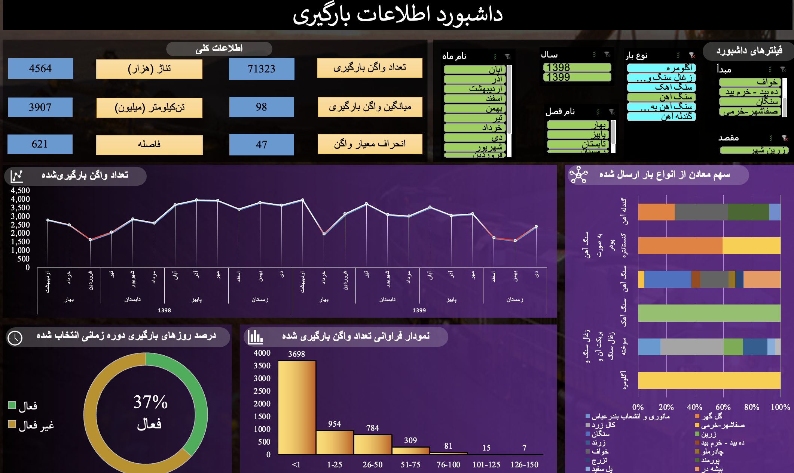

## **Dashboard Title:** Freight Wagon Loading Information Dashboard

### **Overview**

This Excel-based dashboard visualizes detailed freight loading activity across the Iranian railway network. It provides decision-makers with a clear picture of **how many wagons are loaded**, **what types of freight are shipped**, **from which origins and to which destinations**, and **how activity changes over time**. The dashboard integrates monthly, seasonal, and annual statistics to support performance monitoring and planning for freight logistics.

---

---

### **1. General Information Panel (Top-Center)**

This section summarizes key performance indicators (KPIs) for the selected time period:

* **Total Loaded Wagons:** 71,323
* **Total Weight:** 45,640 thousand tons
* **Ton-Kilometers (Freight Distance):** 98 million ton-km
* **Average Load per Wagon:** 3,907 tons
* **Average Distance per Shipment:** 621 km
* **Standard Deviation of Wagon Loads:** 47

These figures quantify both the **volume and variability** of freight operations.

---

### **2. Filter Panel (Top-Right)**

Users can filter data dynamically by:

* **Year:** 1398 or 1399 (2019–2020 CE)
* **Month:** Farvardin through Esfand (Persian months)
* **Season:** Spring, Summer, Autumn, Winter
* **Cargo Type:** Iron Ore, Stone, Coal, Gypsum, Limestone, etc.
* **Origin / Destination / Mine:** (e.g., Gol Gohar, Chadormalu, Sirjan, Bafgh, etc.)

These filters allow regional, temporal, and commodity-specific analysis.

---

### **3. Trend Chart – “Number of Loaded Wagons” (Middle-Left)**

A line chart tracks the **monthly trend** in the number of loaded wagons over the two years (1398 – 1399).

* Peaks and dips correspond to seasonal demand and operational changes.
* Red markers highlight months with below-average loading, signaling possible bottlenecks.

This chart helps identify **cyclical freight activity patterns**.

---

### **4. Activity Status Gauge (Bottom-Left)**

A circular gauge shows the **percentage of active loading days** during the selected period.

* Example: “37 % Active” means loading operations occurred on 37 % of calendar days.
  This metric reflects the **utilization efficiency** of railway loading facilities.

---

### **5. Frequency Chart – “Distribution of Loaded Wagons” (Bottom-Center)**

A histogram shows how often loading activity occurred by number of wagons per day:

* The first bar (< 1 wagon per day) dominates, followed by decreasing frequencies for higher counts.
  This indicates **uneven daily loading volumes**, useful for identifying operational imbalance or scheduling inefficiency.

---

### **6. Commodity Share Chart – “Share of Mines by Freight Type” (Right)**

A stacked horizontal bar chart illustrates how various mines contribute to different freight types (iron ore, coal, gypsum, etc.).

* Each bar represents one mine (e.g., Gol Gohar, Chadormalu, Sirjan).
* The colored segments within each bar show the proportion of each commodity type.

This visualization enables quick comparison of **mine specialization** and **freight composition**.

---

### **7. Key Insights**

* **Temporal Trends:** Freight loading is strongly seasonal, with higher activity in mid-year months.
* **Mine Contributions:** A few major mines (Gol Gohar, Chadormalu) dominate certain freight categories.
* **Operational Efficiency:** Only 37 % of days show loading activity, indicating capacity for improvement.
* **Variability:** The high standard deviation suggests inconsistent wagon loading levels among shipments.

---

### **Summary Paragraph**

> This dashboard provides a comprehensive overview of freight wagon loading across Iran’s railway network. Using Excel-based visual analytics, it integrates time-series trends, commodity distributions, and activity indicators to monitor logistics performance. Users can filter by year, season, month, origin, and cargo type to evaluate loading volumes, efficiency, and commodity flow patterns. The dashboard helps railway managers and analysts assess operational consistency, identify high-performing mines, and detect seasonal or regional fluctuations in freight demand.

